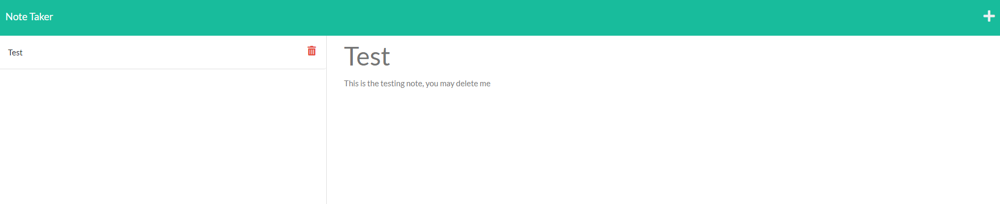
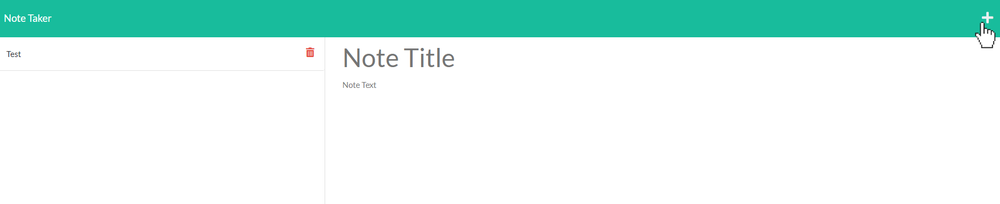
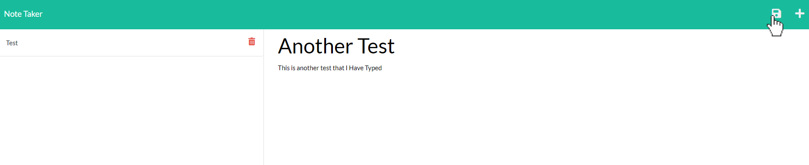
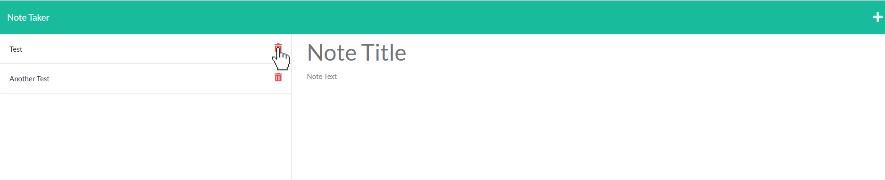

# Note Taking App

## Description
This app allows you to make, read, and delete notes. Your notes will be saved as JSON and called via express api.  

  
**Below Shows the note being read**  

**Below Shows a note being created**  

**Below Shows the note being saved**  

**Below Shows a note to be deleted**  

## Link
Deployed At Following Link:
[Deployed Link](https://note-taker-jonnydbeck.herokuapp.com/)